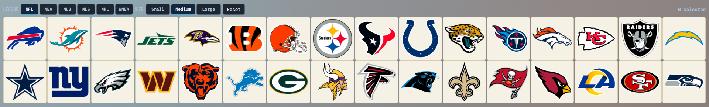

# obs-whatnot-prosportsteams

A lightweight OBS Browser Source overlay for showing NFL, NBA, MLB, MLS, NHL, or WNBA teams in a single square grid.

- Use the **League** buttons to switch between NFL, NBA, MLB, MLS, NHL, and WNBA.
- Use the **Size** buttons to switch square size: Small (25% smaller), Medium (default/current), Large (25% bigger).
- Click any team tile to toggle it as selected.
- Selected teams are grayed out.
- Team selection persists across reloads using `localStorage` (saved separately per league).
- Size selection persists across reloads using `localStorage`.

## Screenshot


## Project Structure
- `overlay.html`: Main overlay page loaded by OBS/browser.
- `styles.css`: Grid and tile styling.
- `overlay.js`: League/team data, render logic, click handling, persistence.
- `assets/logos/*.png`: Local NFL logo image assets.

## Local Run
No build step is required.

### Option 1: Open directly
1. Open `/Users/jeff/Documents/obs/obs-whatnot-prosportsteams/overlay.html` in a browser.

### Option 2: Run a local web server (recommended)
1. In Terminal:
   ```bash
   cd /Users/jeff/Documents/obs/obs-whatnot-prosportsteams
   python3 -m http.server 8080
   ```
2. Open `http://localhost:8080/overlay.html`.

## OBS Setup
1. In OBS, add a **Browser Source**.
2. Use one of these:
   - **Local File**: `/Users/jeff/Documents/obs/obs-whatnot-prosportsteams/overlay.html`
   - **URL**: `http://localhost:8080/overlay.html` (if running local server)
3. Set Browser Source width/height to your scene resolution.
4. Position and scale as needed in your scene.

## Controls
- League Buttons: Switch between NFL, NBA, MLB, MLS, NHL, and WNBA.
- Size Buttons: `Small`, `Medium` (default), `Large`.
- Mouse: Click a team tile to toggle selected/unselected.
- Keyboard: Press `R` to reset all selections.
- Reset Button: Clears selections for the active league.

## Notes
- NBA, MLB, MLS, NHL, and WNBA logos are loaded from ESPN's logo CDN.
- If OBS caches old styles, use **Refresh cache of current page** in Browser Source properties.
